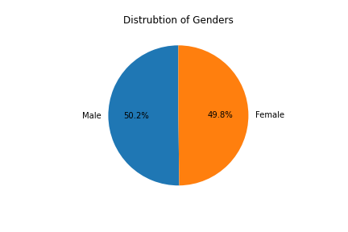
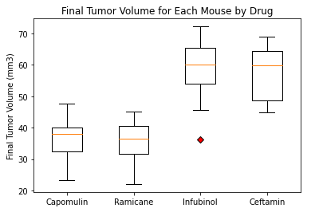
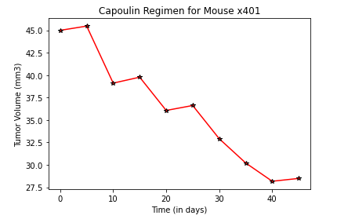

# Power of Plots

### Science is for Me

#### Background
> While my data companions rushed off to jobs in finance and government, I have remained adamant that science was the way for me. Staying true to my mission, I've joined Pymaceuticals Inc., a burgeoning pharmaceutical company based out of San Diego. Pymaceuticals specializes in anti-cancer pharmaceuticals. In its most recent efforts, it began screening for potential treatments for squamous cell carcinoma (SCC), a commonly occurring form of skin cancer.

>In this study, 249 mice identified with SCC tumor growth were treated through a variety of drug regimens. Over the course of 45 days, tumor development was observed and measured. The purpose of this study was to compare the performance of Pymaceuticals' drug of interest, Capomulin, versus the other treatment regimens. You have been tasked by the executive team to generate all of the tables and figures needed for the technical report of the study. The executive team also has asked for a top-level summary of the study results.

##                                              Observations and Insights 

1. When analyzing the genders used in the research, it's easy to determine the research lab used a fairly equivalent female to male ratio of mice. Further you could examine if there was any indicators that a certain drug had more efficacy on one gender versus another. 

2. The boxplot examines the differences for the four drugs, Capomulin, Ramicane, Infubinol, Ceftamin. This is based on the average final tumor volume while including outliers. It was interesting that only one drug, Infubinol, had an outlier and determining why or possible cause would be helpful. Capomulin and Ramicane had the most similar values with an indication that it was more equally effective. 

3. The line plot has a fascinating visualization for the drug Capomulin. It shows a clear degression of the cancer after the period of 45 days. Enlongating the trials would be fasicinating on how well the drugs would reduce the tumor volume size. 